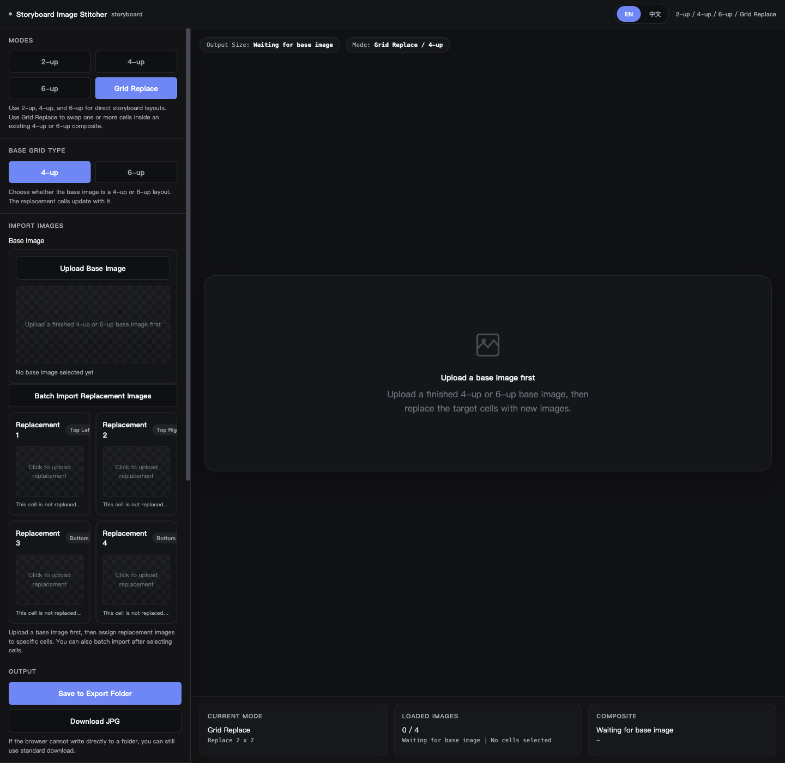

<!-- SEO: storyboard image editor, local storyboard image stitcher, batch text watermark browser app, replace cells storyboard tool, local no upload image workflow -->

<div align="center">

# Storyboard Image Editor

**Storyboard Image Editor is a local browser tool for storyboard stitching, replace-cell edits, and batch text watermarking with no backend, no upload, and no install step.**


English | [简体中文](./README.zh-CN.md)

</div>

---

## Why Storyboard Image Editor?

| Problem | What this project does |
|---|---|
| Storyboard stitching and watermarking often live in separate tools | Keeps both stages in one local browser workflow |
| Finished boards often need only a few cells replaced | Includes a dedicated `Replace Cells` mode for existing `4-up` and `6-up` boards |
| You may only need one stage at a time | Supports `Pipeline`, `Stitch Only`, and `Watermark Only` |
| Export safety matters during review loops | Uses collision-safe export naming instead of overwriting files silently |
| Image privacy matters | Processes files locally in the browser with no server upload |

> **TL;DR** - Use one local HTML app to assemble storyboard layouts, replace selected cells, and batch-apply text watermarks. Everything runs locally in the browser.

## Key Features

### Workflow Modes
- **Pipeline** - Stitch first, then send the result into the watermark stage.
- **Stitch Only** - Use the storyboard composer without opening the watermark step.
- **Watermark Only** - Batch-apply text watermarks to local images without stitching.

### Stitching
- **`2-up` / `4-up` / `6-up` layouts** for fast storyboard assembly.
- **Extend 4 to 6** to keep an existing `4-up` board and append a new bottom row.
- **Replace Cells** to swap only selected cells inside a finished composite.
- **Ordered import + slot swapping** for predictable layout control.

### Watermarking
- **Text watermark layers** with drag, size, and rotation controls.
- **Batch copy to all images** so one layout can be reused across a folder.
- **Batch-safe export names** to reduce accidental overwrite risk.

### Language
- **Default startup language: Chinese**
- **Manual language switch:** `中文 / EN`
- Shell-level language state is forwarded into the embedded sub-apps.

## Data Safety / How It Works

```text
Local images
   |
   v
Storyboard Image Editor (index.html + app.js)
   |
   +--> Stitch app (apps/stitcher)
   |       |
   |       +--> 2-up / 4-up / 6-up / Extend 4 to 6 / Replace Cells
   |
   +--> Watermark app (apps/watermark)
   |       |
   |       +--> Text watermark layers + batch export
   |
   v
Local output files
```

- No backend service is required.
- No image data is uploaded.
- Folder export depends on browser support for local file permissions.

## Quick Start

```bash
cd "Storyboard Image Editor"
open index.html
```

Windows: double-click `index.html` in File Explorer.  
No install step, package manager, or build command is required for normal use.

## Screenshots

### Stitcher



## Requirements

- Modern desktop browser
- Chrome / Edge recommended for folder export via File System Access API
- Local image files such as JPG, PNG, WebP, GIF, BMP, and AVIF

## Configuration

| Item | Default | Description |
|---|---|---|
| Startup language | `Chinese` | Can be switched to English at runtime |
| Workflow mode | `Pipeline` | Can be changed to `Stitch Only` or `Watermark Only` |
| Pipeline handoff | Enabled | Sends stitch output into the watermark stage |
| QA script | `qa/verify-shell-i18n.js` | Verifies shell language propagation |

## Project Structure

```text
Storyboard Image Editor/
├── index.html
├── app.js
├── apps/
│   ├── stitcher/
│   │   ├── index.html
│   │   ├── app.js
│   │   └── assets/
│   └── watermark/
│       ├── index.html
│       └── assets/
├── assets/
├── qa/
│   └── verify-shell-i18n.js
└── build-mac-app.sh
```

### Architecture Notes
- `index.html` and `app.js` provide the shell, mode switching, and pipeline handoff.
- `apps/stitcher` owns layout assembly and replace-cell workflows.
- `apps/watermark` owns text watermark editing and batch export.

## Use Cases

- Turn AI-generated stills into storyboard boards quickly.
- Update only a few cells inside a finished `4-up` or `6-up` composite.
- Extend an existing `4-up` storyboard into a `6-up` layout.
- Apply consistent text watermarks across a local review batch.
- Keep the full image workflow local for privacy-sensitive material.

## FAQ

<details>
<summary>Can I use only one stage instead of the full pipeline?</summary>

Yes. `Stitch Only` and `Watermark Only` are both complete modes.

</details>

<details>
<summary>Does Replace Cells stay available after the shell merge?</summary>

Yes. `Replace Cells` remains part of the stitcher app.

</details>

<details>
<summary>Are my images uploaded anywhere?</summary>

No. Processing stays inside the local browser session.

</details>

<details>
<summary>Why is Chrome or Edge recommended?</summary>

Direct folder export depends on the File System Access API, which is best supported in Chromium-based desktop browsers.

</details>

<details>
<summary>Does this project require npm, Electron, or a backend service?</summary>

No. The primary workflow is plain local HTML, CSS, and JavaScript in the browser.

</details>

## QA Verification

```bash
node "qa/verify-shell-i18n.js"
```

Expected output:

```text
[PASS] Shell i18n toggle verification passed.
```

## Packaging

- `index.html` is the main entry for direct browser use.
- `build-mac-app.sh` builds a lightweight macOS app wrapper that opens the local HTML entry point.

## Contributing

Contributions should improve workflow clarity, export safety, and local-first reliability.

## License

See [LICENSE](./LICENSE). This project is published under a personal-use-only license.

---

<div align="center">

**Storyboard Image Editor** - Stitch, revise, and watermark storyboard images in one local flow.

</div>
