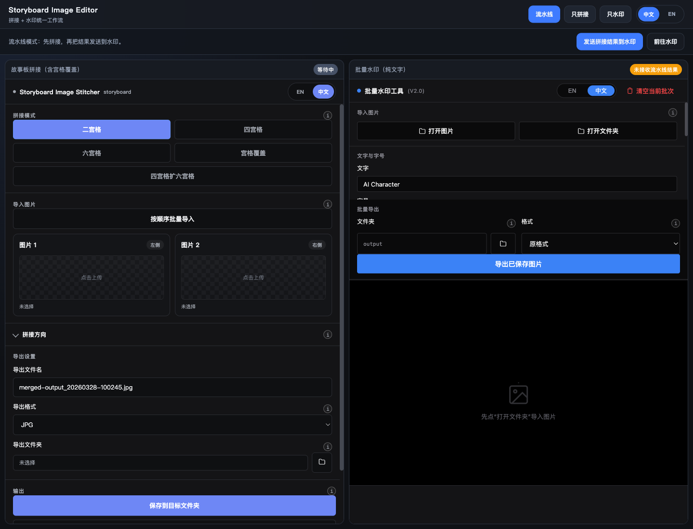

<!-- SEO: Storyboard Image Editor, 本地故事板拼接工具, 浏览器批量文字水印, 宫格覆盖替换工具, 本地无上传图像工作流 -->

<div align="center">

# Storyboard Image Editor

**Storyboard Image Editor 是一个本地浏览器工具，用来完成故事板拼接、宫格替换和批量文字水印，全程无需后端、无需上传、无需安装。**


[English](./README.md) | 简体中文

</div>

---

## 为什么用 Storyboard Image Editor？

| 问题 | 这个项目怎么解决 |
|---|---|
| 故事板拼接和水印通常分散在不同工具里 | 把两个阶段收进一个本地浏览器工作流 |
| 成品故事板常常只想替换少数几个格子 | 提供专门的 `Replace Cells` 模式处理 `4-up` / `6-up` 成品图 |
| 有时只需要其中一个阶段 | 支持 `Pipeline`、`Stitch Only`、`Watermark Only` |
| 审片和返修时导出安全很重要 | 使用防重名导出，减少误覆盖风险 |
| 图片隐私很重要 | 全程浏览器本地处理，不上传到服务器 |

> **TL;DR** - 用一个本地 HTML 应用完成故事板拼接、局部格子替换和批量文字水印，整个流程都在浏览器本地运行。

## 核心功能

### 工作模式
- **Pipeline** - 先拼接，再把结果发送到水印阶段。
- **Stitch Only** - 只使用故事板拼接能力。
- **Watermark Only** - 不做拼接，直接对本地图片批量添加文字水印。

### 拼接能力
- **`2-up` / `4-up` / `6-up` 布局**，适合快速整理故事板。
- **Extend 4 to 6**，保留已有 `4-up`，并在底部扩成 `6-up`。
- **Replace Cells**，只替换成品拼接图中的指定格子。
- **顺序导入 + 槽位交换**，让布局顺序更可控。

### 水印能力
- **文字水印图层**，支持拖拽、字号和旋转。
- **一键复制到全部图片**，便于批量统一版式。
- **安全导出命名**，减少重名覆盖风险。

### 语言
- **默认启动语言：中文**
- **手动切换：** `中文 / EN`
- 壳层语言状态会同步到两个嵌入式子应用。

## 数据安全 / 工作方式

```text
本地图片
   |
   v
Storyboard Image Editor（index.html + app.js）
   |
   +--> Stitch 子应用（apps/stitcher）
   |       |
   |       +--> 2-up / 4-up / 6-up / Extend 4 to 6 / Replace Cells
   |
   +--> Watermark 子应用（apps/watermark）
   |       |
   |       +--> 文字水印图层 + 批量导出
   |
   v
本地输出文件
```

- 不需要后端服务。
- 不会上传任何图片数据。
- 文件夹导出依赖浏览器对本地文件权限的支持。

## 快速开始

```bash
cd "Storyboard Image Editor"
open index.html
```

Windows 可在资源管理器中双击 `index.html`。  
正常使用不需要安装依赖、不需要包管理器，也不需要构建步骤。

## 截图

### Editor 流水线界面



## 环境要求

- 现代桌面浏览器
- 推荐 Chrome / Edge，以便使用 File System Access API 做文件夹导出
- 本地图片格式，如 JPG、PNG、WebP、GIF、BMP、AVIF

## 配置说明

| 项目 | 默认值 | 说明 |
|---|---|---|
| 启动语言 | `中文` | 运行时可切换为英文 |
| 工作模式 | `Pipeline` | 可切换为 `Stitch Only` 或 `Watermark Only` |
| 流水线传递 | 启用 | 把拼接结果发给水印阶段 |
| QA 脚本 | `qa/verify-shell-i18n.js` | 用于验证壳层语言同步 |

## 项目结构

```text
Storyboard Image Editor/
├── index.html
├── app.js
├── apps/
│   ├── stitcher/
│   │   ├── index.html
│   │   ├── app.js
│   │   └── assets/
│   └── watermark/
│       ├── index.html
│       └── assets/
├── assets/
├── qa/
│   └── verify-shell-i18n.js
└── build-mac-app.sh
```

### 架构说明
- `index.html` 和 `app.js` 负责壳层、模式切换和流水线传递。
- `apps/stitcher` 负责拼接布局和宫格替换。
- `apps/watermark` 负责文字水印编辑和批量导出。

## 适用场景

- 把 AI 生成静帧快速整理成故事板。
- 只替换现成 `4-up` / `6-up` 成品中的少数格子。
- 把已有 `4-up` 快速扩展成 `6-up`。
- 对一批本地图片统一加文字水印。
- 在隐私敏感场景下保持全流程本地处理。

## FAQ

<details>
<summary>我可以不走完整 Pipeline，只用某一个阶段吗？</summary>

可以，`Stitch Only` 和 `Watermark Only` 都是完整模式。

</details>

<details>
<summary>壳层合并后，Replace Cells 还在吗？</summary>

在，`Replace Cells` 仍然属于拼接子应用的一部分。

</details>

<details>
<summary>图片会上传到任何服务器吗？</summary>

不会，所有处理都停留在浏览器本地会话里。

</details>

<details>
<summary>为什么更推荐 Chrome 或 Edge？</summary>

因为直接导出到本地文件夹依赖 File System Access API，Chromium 系浏览器支持最好。

</details>

<details>
<summary>这个项目需要 npm、Electron 或后端服务吗？</summary>

不需要。主流程就是本地浏览器直接运行的 HTML、CSS 和 JavaScript。

</details>

## QA 验证

```bash
node "qa/verify-shell-i18n.js"
```

期望输出：

```text
[PASS] Shell i18n toggle verification passed.
```

## 打包方式

- `index.html` 是浏览器直接运行的主入口。
- `build-mac-app.sh` 可生成一个轻量的 macOS App 包装器，用来打开本地 HTML 入口。

## Contributing

建议把改动聚焦在工作流清晰度、导出安全性和本地优先稳定性。

## License

见 [LICENSE](./LICENSE)。本项目以“仅限个人使用”许可证发布。

---

<div align="center">

**Storyboard Image Editor** - 在一个本地流程里完成拼接、修订和水印。

</div>
